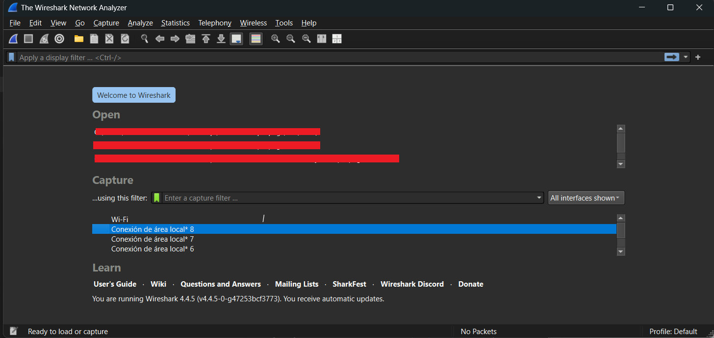
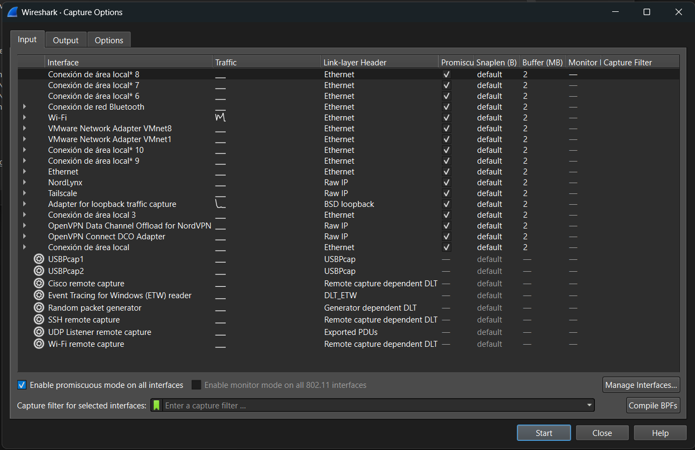
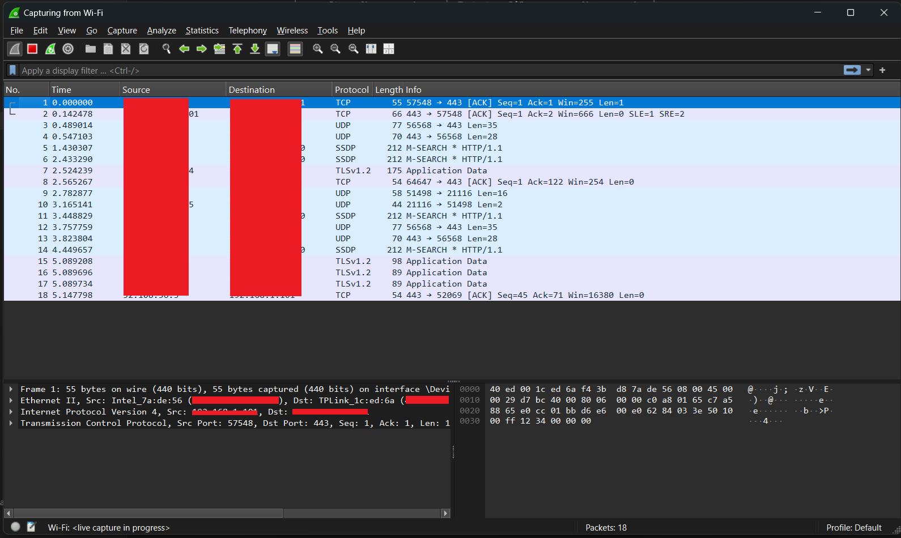
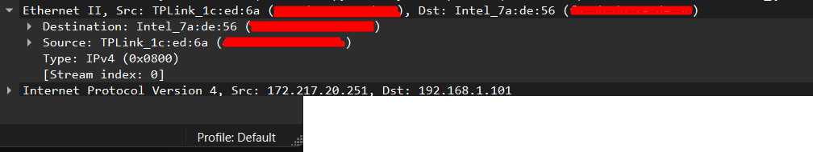
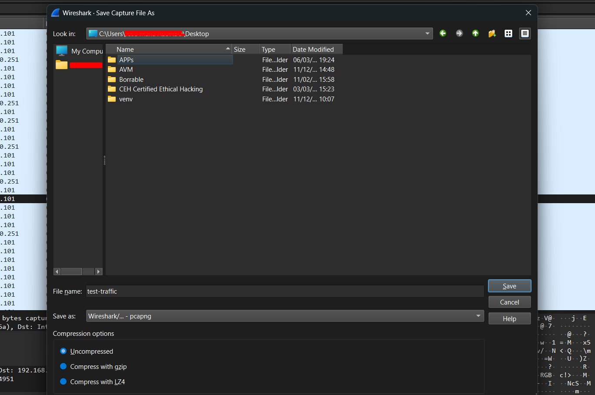

> **Navigation:** [← Introduction](./01-Introduction) | [Index](00-index) |[ Next: Capture Filters →](./03-Capture-Filters)

## Table of Contents 
- [2.1 The Welcome Screen](#21-the-welcome-screen) 
- [2.2 Understanding Interfaces](#22-understanding-interfaces) 
- [2.3 Capture Options](#23-capture-options) 
- [2.4 Starting and Stopping a Capture](#24-starting-and-stopping-a-capture) 
- [2.5 File Formats — pcap vs pcapng](#25-file-formats--pcap-vs-pcapng) 
- [2.6 Saving and Exporting Captures](#26-saving-and-exporting-captures) 
- [2.7 Checksum Offloading — False Errors](#27-checksum-offloading--false-errors) 

---

## 2.1 The Welcome Screen

When you launch Wireshark you land on the welcome screen. This is your starting point for every capture session.



The welcome screen is divided into three sections:

**Open**
A list of recently opened `.pcap` / `.pcapng` files. Double-click any entry to reopen it instantly for offline analysis.

**Capture**
Lists all network interfaces Wireshark can see on your machine.  
Each interface shows a **live activity sparkline** showing current traffic volume.  
Interfaces with active traffic show a moving graph. Idle interfaces show a flat line.

**Learn**
Links to official documentation, the Wireshark Wiki, community forums.

---

**Status bar** (bottom of the window):
- Bottom left: Current state — `Ready to load or capture`
- Bottom center: Packet count (empty until a capture is loaded)
- Bottom right: Active profile — `Default`

> 🔗 Profiles let you save custom Wireshark configurations per engagement type.  
> More in [13 — Tips & Tricks](./13-Tips-and-Tricks.md)

---

## 2.2 Understanding Interfaces

The interface list shows every network adapter Wireshark can access.  
On Windows, adapters often have non-intuitive names — here is how to read them:

| Interface Name | What it typically is |
|---------------|---------------------|
| `Wi-Fi` | Wireless adapter |
| `Ethernet` | Physical wired adapter |
| `Local Area Connection* N` | Virtual adapter — VMware, VirtualBox, VPN, loopback |
| `Loopback` | Local machine traffic only (127.0.0.1) |
| `Any` | Capture on all interfaces simultaneously (Linux only) |

> 💡 **How to identify the right interface:**
> 1. Watch the sparklines — the active one is your target
> 2. Open `cmd` and run `ipconfig` to match IP addresses to adapter names
> 3. In Wireshark go to **Capture > Options** to see IP addresses next to each interface

> ⚠️ Virtual adapters (`Conexión de área local* N`) are created by virtualization software (VMware, NordLynx, VirtualBox, Hyper-V) and VPN clients. Capturing on them shows traffic between your host and VMs or VPN tunnel traffic.

---

## 2.3 Capture Options

The Capture Options dialog (`Ctrl + K`) is where you configure everything before starting a capture. It has three tabs: **Input**, **Output**, and **Options**.



### Input Tab
The Input tab shows every interface Wireshark can access, with the following columns:

| Column | Meaning |
|--------|---------|
| **Interface** | Adapter name as reported by Windows |
| **Traffic** | Live sparkline — moving graph means active traffic |
| **Link-layer Header** | The data link type. `Ethernet` is standard. `Raw IP` skips the Ethernet header. `BSD loopback` is for loopback interfaces |
| **Promiscu.** | Whether promiscuous mode is enabled for this interface |
| **Snaplen (B)** | Snapshot length in bytes. `default` = full packet capture |
| **Buffer (MB)** | Kernel ring buffer size. Default is 2MB per interface |
| **Monitor** | Wi-Fi monitor mode toggle (802.11 raw frame capture) |
| **Capture Filter** | Per-interface BPF capture filter |


### Reading Your Interface List

Your interface list reveals exactly what is running on the machine:

| Interface | Type | What it means |
|-----------|------|---------------|
| `Conexión de área local* N` | Ethernet | Virtual adapters — Hyper-V, VirtualBox |
| `Wi-Fi` | Ethernet | Wireless adapter |
| `Conexión de red Bluetooth` | Ethernet | Bluetooth network adapter |
| `VMware Network Adapter VMnetN` | Ethernet | VMware virtual networks (VMnet1 = Host-only, VMnet8 = NAT) |
| `NordLynx` | Raw IP | NordVPN WireGuard tunnel interface |
| `Tailscale` | Raw IP | Tailscale VPN mesh interface |
| `Adapter for loopback traffic capture` | BSD loopback | Npcap loopback adapter — captures `127.0.0.1` traffic |
| `OpenVPN Data Channel Offload for NordVPN` | Raw IP | NordVPN OpenVPN data plane |
| `OpenVPN Connect DCO Adapter` | Raw IP | OpenVPN kernel-mode data channel |
| `Ethernet` | Ethernet | Physical wired NIC |
| `USBPcap1 / USBPcap2` | USBPcap | USB traffic capture (requires USBPcap install) |
| `Cisco remote capture` | Remote | Capture from a remote Cisco device |
| `SSH remote capture` | Remote | Capture on a remote host via SSH tunnel |
| `UDP Listener remote capture` | Remote | Receive capture stream over UDP |
| `Wi-Fi remote capture` | Remote | Remote wireless capture |
| `Event Tracing for Windows (ETW) reader` | DLT_ETW | Windows kernel event tracing |
| `Random packet generator` | Generator | Generates synthetic test packets |

> 💡 **For pentesters:** The presence of `NordLynx`, `Tailscale`, and `OpenVPN` interfaces means you can capture VPN tunnel traffic directly — useful for analyzing what goes in and out of your VPN during an engagement.

> 💡 **SSH remote capture** is particularly powerful — it lets you run a capture on a remote Linux server and stream packets directly into your local Wireshark GUI. We cover this in detail in [09 — tshark CLI](./09-tshark-CLI.md).


### Bottom Controls

| Control | Function |
|---------|---------|
| **Enable promiscuous mode on all interfaces** | ✅ Checked by default — captures all traffic on the segment, not just yours |
| **Enable monitor mode on all 802.11 interfaces** | Off by default — enables raw Wi-Fi frame capture |
| **Capture filter for selected interfaces** | Apply a BPF filter to all selected interfaces at once |
| **Compile BPFs** | Validates and compiles your capture filter — useful to verify syntax before starting |
| **Manage Interfaces** | Add/remove interfaces, configure remote capture sources |

> ⚠️ **Promiscuous mode on switched networks:**  
> On a modern switched network, promiscuous mode only shows traffic to/from your machine plus broadcast/multicast traffic. To see other hosts' traffic you need port mirroring (SPAN) or ARP spoofing. Promiscuous mode alone is not enough on a switch.


### Output Tab

The Output tab controls where and how captures are saved:

| Setting | Description |
|---------|-------------|
| **File** | Path to save the capture file. Leave blank to keep in memory. |
| **Output format** | `pcapng` (default, recommended) or `pcap` |
| **Create a new file automatically** | Enables ring buffer / file rotation |
| **after N packets** | Rotate file every N packets |
| **after N megabytes** | Rotate file when it reaches N MB |
| **after N seconds** | Rotate file every N seconds |
| **Ring buffer with N files** | Keep only the last N files, overwrite oldest |

> 💡 **Ring buffer tip:** For long-running captures (monitoring overnight, red team ops), set a ring buffer of 10 × 100MB files. You always have the last ~1GB of traffic without filling the disk.

### Options Tab

| Setting | Description |
|---------|-------------|
| **Update list of packets in real time** | Refreshes the packet list while capturing. Disable on busy interfaces to reduce GUI lag. |
| **Automatically scroll during live capture** | Scrolls to latest packet. Disable when you want to inspect a specific packet mid-capture. |
| **Resolve MAC addresses** | Shows vendor names instead of raw MACs |
| **Resolve network names** | DNS reverse lookup on IP addresses — can slow capture and generate extra DNS traffic |
| **Resolve transport names** | Shows `http` instead of `80`, `dns` instead of `53` |
| **Use pcapng format** | Always leave enabled |

> ⚠️ **Name resolution warning:** Enabling network name resolution during a capture causes Wireshark to make DNS queries for every IP it sees.  
> On a pentest this can expose your presence — reverse DNS queries for internal IPs may be logged. Keep name resolution **off** during sensitive captures.

---

## 2.4 Starting and Stopping a Capture

### Starting a Capture

From the welcome screen, double-click any interface to start capturing immediately (alternatively use **Capture > Start** or press `Ctrl + E`).

The status bar at the bottom confirms the state:
```
Wi-Fi: <live capture in progress>        Packets: 18        Profile: Default
```



---

### The Three Panels

This is the core Wireshark layout you will use for every analysis session:
```
┌─────────────────────────────────────────────────────────────┐
│  PACKET LIST — one row per packet (TOP)                     │
│  No. │ Time │ Source │ Destination │ Protocol │ Length │Info│
├─────────────────────────────────────────────────────────────┤
│  PACKET DETAILS (Left)— protocol tree of selected packet    │
│  ▶ Frame                                                    │
│  ▶ Ethernet II                                              │
│  ▶ Internet Protocol Version 4                              │
│  ▶ Transmission Control Protocol                            │
├─────────────────────────────────────────────────────────────┤
│  PACKET BYTES — (Roght) raw hex + ASCII of selected packet  │
│  0000  40 ed 00 1c ed 6a f4 3b ...    @····j·;              │
└─────────────────────────────────────────────────────────────┘
```

**Packet List columns explained:**

| Column | Description |
|--------|-------------|
| **No.** | Packet number — sequential from start of capture |
| **Time** | Seconds elapsed since first packet (default). Can be changed to absolute clock time via **View > Time Display Format** |
| **Source** | Sender IP address (or MAC at Layer 2) |
| **Destination** | Receiver IP address |
| **Protocol** | Highest-layer protocol Wireshark identified |
| **Length** | Total packet size in bytes |
| **Info** | Human-readable summary — flags, ports, sequence numbers, protocol details |

---

### Reading the Packet List

Your capture shows a typical Windows Wi-Fi session at rest:

| Protocol | What you're seeing |
|----------|-------------------|
| `TCP` | Established connections — ACK exchanges on port 443 (HTTPS) |
| `UDP` | Connectionless traffic — ports 443 (QUIC), 56568, 21116 |
| `SSDP` | Simple Service Discovery Protocol — UPnP device discovery broadcasts (`M-SEARCH * HTTP/1.1`) |
| `TLSv1.2` | Encrypted application data over existing TLS sessions |

> 💡 **SSDP M-SEARCH broadcasts** are very common on home/office networks.  
> Devices like smart TVs, printers, and routers announce themselves constantly.  
> In a forensics context, unexpected SSDP traffic can reveal unauthorized devices.

---

### The Packet Details Panel

Clicking any packet expands its protocol tree in the middle panel.  
Packet 1 shows a full Layer 2 → 3 → 4 decode:
```
▶ Frame 1: 55 bytes on wire (440 bits), 55 bytes captured on interface \Device\...
▶ Ethernet II, Src: Intel_7a:de:56, Dst: TPLink_1c:ed:6a
▶ Internet Protocol Version 4, Src: 192.168.1.x, Dst: [redacted]
▶ Transmission Control Protocol, Src Port: 57548, Dst Port: 443, Seq: 1, Ack: 1, Len: 1
```

Each layer can be expanded with the **▶** arrow to reveal every field and its value.  



Clicking any field in the details panel **highlights the corresponding bytes** in the hex panel below.

> 💡 This cross-panel highlighting is one of Wireshark's most powerful feature. Click a field like `Src Port` in the details and the exact bytes light up in hex. Essential for understanding protocol structure and spotting anomalies.

---

### The Packet Bytes Panel

The bottom panel shows the raw packet in two columns:
```
0000  40 ed 00 1c ed 6a f4 3b  d8 7a de 56 08 00 45 00   @····j·; ·z·V··E·
0010  00 29 d7 bc 40 00 80 06  00 00 c0 a8 01 65 c7 a5   ·)··@··· ·····e··
0020  88 65 e0 cc 01 bb d6 e6  00 e0 62 84 03 3e 50 10   ·e······ ··b··>P·
0030  00 ff 12 34 00 00 00                                ···4···
```

- **Left column:** Byte offset in hex (0000, 0010, 0020...)
- **Middle:** Raw bytes in hexadecimal
- **Right:** ASCII representation — printable characters show as text, non-printable as dots

> 💡 The ASCII column is where you spot **plaintext credentials, hostnames, and readable strings inside packets**  without needing to follow a full stream.

---

### Stopping a Capture

To stop a live capture:
- Click the **red square ⏹ Stop** button in the toolbar
- Or press `Ctrl + E`
- Or go to **Capture > Stop**

After stopping, the status bar updates:
```
Wi-Fi:                    Packets: 18        Profile: Default
```

The capture remains in memory. Save it before closing Wireshark or it will be lost.

> ⚠️ Wireshark holds the entire capture in RAM while it's open.  
> Very long captures on busy interfaces can consume gigabytes of memory.  
> For extended captures always write directly to a file via Capture Options > Output.

---

## 2.5 File Formats — pcap vs pcapng

Before saving, it's worth understanding the two formats you'll encounter constantly:

| Feature | `.pcap` | `.pcapng` |
|---------|---------|----------|
| **Standard** | Legacy (libpcap) | Modern (next-gen) |
| **Multiple interfaces** | ❌ One interface only | ✅ Multiple interfaces in one file |
| **Packet comments** | ❌ No | ✅ Yes — annotate individual packets |
| **Capture metadata** | ❌ Minimal | ✅ Rich — OS, interface name, timestamps |
| **Name resolution blocks** | ❌ No | ✅ Embedded DNS resolution |
| **Compression** | ❌ No native | ✅ gzip / LZ4 |
| **Wireshark default** | No | ✅ Yes |
| **Tool compatibility** | Universal | Most modern tools |

**When to use each:**

- **pcapng** — always, for your own captures. Richer data, better tooling.
- **pcap** — when sharing with older tools or scripts that don't support pcapng yet.  
  Convert with: `tshark -r input.pcapng -w output.pcap`

---

## 2.6 Saving and Exporting Captures

### Saving a Capture

Go to **File > Save As** (`Ctrl + Shift + S`) to save your capture to disk.



The save dialog has three key controls at the bottom:

**File name**
```
test-traffic
```
Name your captures descriptively — include date, interface, and context:
```
date_wifi_normal-baseline.pcapng
date_eth0_pentest-lab.pcapng
```
>💡 When auditing a system is very important to note date and hourtimes.

**Save as (format selector)**
```
Wireshark/... - pcapng
```
The default is `pcapng`. Click the dropdown to see all supported formats including legacy `.pcap`, various vendor formats (Cisco, Microsoft Network Monitor), and more.

**Compression options**

| Option | Use case |
|--------|---------|
| **Uncompressed** | Default — fastest write, largest file, best compatibility |
| **Compress with gzip** | ~60-70% size reduction, slight CPU overhead, widely supported |
| **Compress with LZ4** | Fastest compression, good ratio — ideal for large captures on disk |

---

### Exporting Specific Packets

You don't always need to save the entire capture.  
**File > Export Specified Packets** lets you save a subset:

- A range of packet numbers (`1-100, 250, 300-400`)
- Only displayed packets (matching your current display filter)
- Only marked packets (packets you manually marked with `Ctrl + M`)

> 💡 This is extremely useful after filtering down to suspicious traffic —  
> export just the relevant packets to share with a colleague or include in a report.

### Merging Captures

To combine multiple `.pcap` / `.pcapng` files:  
**File > Merge** — opens a dialog to merge files chronologically by timestamp.

Alternatively via tshark:
```bash
mergecap -w merged.pcapng file1.pcapng file2.pcapng file3.pcapng
```

> 🔗 More file manipulation with tshark: [09 — tshark CLI](./09-tshark-CLI.md)

---

## 2.7 Checksum Offloading — False Errors

If you capture on a live interface (not from a file), you will almost certainly see packets flagged with **checksum errors** highlighted in black:
```
[Checksum Status: Bad]
[Expert Info (Warning/Checksum): Bad checksum]
```

> ⚠️ These are almost always **false positives** — not real errors.

**Why this happens:**

Modern NICs use **checksum offloading** — the NIC calculates TCP/IP checksums in hardware before the packet leaves the wire, *after* the OS has handed it off. Wireshark captures the packet *before* the NIC fills in the checksum, so it sees a zeroed or incomplete checksum value and flags it as bad.

The packet on the wire is perfectly valid — the NIC completes it before transmission.

**How to disable these warnings:**

Go to **Edit > Preferences > Protocols**:

- **IPv4** → uncheck `Validate the IPv4 checksum if possible`
- **TCP** → uncheck `Validate the TCP checksum if possible`
- **UDP** → uncheck `Validate the UDP checksum if possible`

Or apply a display filter to hide them during analysis:
```
!(tcp.checksum.status == "Bad") && !(udp.checksum.status == "Bad")
```

> 💡 Checksum errors in a **pcap file** (not live capture) are more meaningful —  
> they may indicate packet corruption, capture issues, or manipulated traffic.  
> In forensics, genuine checksum errors on saved files are worth investigating.

---

> **Chapter complete.**  
> You now know how to select interfaces, configure capture options, read the three panels,  
> save captures in the right format, and avoid false checksum errors.

---

> **Next:** 


---
[Go to the top](#introduction)   
> **Navigation:** [← Introduction](./01-Introduction) | [03 — Capture Filters →](./03-Capture-Filters.md)
---