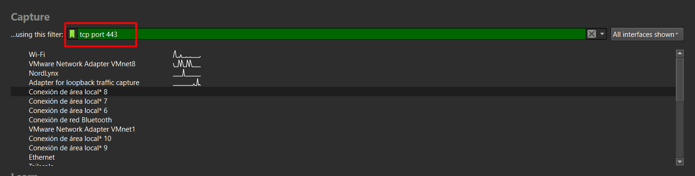

> **Navigation:** [← Next: Capture Basics →](./02-Capture-Basics) | [Index](00-index) | [Next: Display Filters →](./04-Display-Filters)

## Table of Contents
- [3.1 Capture Filters vs Display Filters](#31-capture-filters-vs-display-filters)
- [3.2 BPF Syntax Basics](#32-bpf-syntax-basics)
- [3.3 Host and IP Filtering](#33-host-and-ip-filtering)
- [3.4 Port Filtering](#34-port-filtering)
- [3.5 MAC Address Filtering](#35-mac-address-filtering)
- [3.6 Combining Filters](#36-combining-filters)
- [3.7 The Filter Bar — Visual Feedback](#37-the-filter-bar--visual-feedback)
- [3.8 Cheatsheet](#38-cheatsheet)

---
## 3.1 Capture Filters vs Display Filters

This is one of the most important distinctions in Wireshark:

| | Capture Filter | Display Filter |
|--|---------------|---------------|
| **When applied** | Before capture — at the kernel level | After capture — in the GUI |
| **Syntax** | BPF (Berkeley Packet Filter) | Wireshark display filter language |
| **Effect** | Unmatched packets are never saved | Unmatched packets are hidden, not deleted |
| **Can change mid-capture** | ❌ No — fixed at capture start | ✅ Yes — change anytime |
| **Performance** | ✅ Very efficient — runs in kernel | Slower — runs in userspace |
| **Risk** | ⚠️ Miss packets if filter is wrong | Safe — original data always intact |

> ⚠️ **Critical difference:**  
> A capture filter permanently excludes packets — they are never recorded.  
> If your filter is wrong you lose that traffic forever.  
> A display filter just hides packets — the full capture is always preserved underneath.  
> When in doubt, **capture everything and filter with display filters later.**

> 🔗 Display filters covered in full in [04 — Display Filters](./04-Display-Filters.md)

---

## 3.2 BPF Syntax Basics

Capture filters use **BPF syntax** — the same language used by `tcpdump`.  
If you know tcpdump filters, you already know capture filters.

BPF filters are built from three components:

**Primitives** — the basic building blocks:

| Type | Examples |
|------|---------|
| `host` | Match a specific IP address |
| `net` | Match a network range |
| `port` | Match a specific port |
| `portrange` | Match a range of ports |
| `proto` | Match a protocol number |

**Qualifiers** — modify what the primitive matches:

| Qualifier | Type | Description |
|-----------|------|-------------|
| `src` | Direction | Source address/port only |
| `dst` | Direction | Destination address/port only |
| `host` | Type | Match IP address |
| `net` | Type | Match network |
| `port` | Type | Match port number |
| `tcp`, `udp`, `icmp` | Protocol | Match protocol |

**Operators** — combine primitives:

| Operator | Symbols | Example |
|----------|---------|---------|
| AND | `and` / `&&` | `host 10.0.0.1 and port 80` |
| OR | `or` / `\|\|` | `port 80 or port 443` |
| NOT | `not` / `!` | `not port 22` |

---

## 3.3 Host and IP Filtering

### Capture traffic to or from a specific host
```
host 192.168.1.100
```
Captures all traffic where source **or** destination is `192.168.1.100`.

---

### Capture traffic only from a specific source
```
src host 192.168.1.100
```
Only packets **sent by** `192.168.1.100`.  
Useful when you want to isolate outbound traffic from a suspected compromised host.

---

### Capture traffic only to a specific destination
```
dst host 192.168.1.100
```
Only packets **destined for** `192.168.1.100`.  
Useful for monitoring inbound connections to a server.

---

### Capture traffic between two specific hosts
```
host 192.168.1.100 and host 192.168.1.200
```
Only packets where both hosts are involved in the conversation.

---

### Capture a network range
```
net 192.168.1.0/24
```
Captures all traffic within the `192.168.1.0/24` subnet.  
Essential when monitoring an entire network segment.
```
src net 10.0.0.0/8
```
Only traffic originating from the `10.0.0.0/8` range — useful for  
isolating internal traffic from RFC1918 space.

---

### Exclude a specific host
```
not host 192.168.1.1
```
Captures everything **except** traffic to/from `192.168.1.1`.  
Useful to exclude your gateway/router from cluttering the capture.

> 💡 **Pentesting use case:**  
> When capturing on a target network, filter out your own machine's IP  
> to see only victim traffic:
> ```
> not host 192.168.1.50
> ```

---

## 3.4 Port Filtering

### Capture a specific port
```
port 80
```
Captures all TCP or UDP traffic on port 80 (HTTP).

---

### Capture a specific protocol port with direction
```
dst port 443
```
Only packets destined for port 443 — outbound HTTPS connections.
```
src port 53
```
Only DNS responses (packets coming **from** port 53).

---

### Capture multiple ports
```
port 80 or port 443
```
HTTP and HTTPS traffic together.  
```
port 21 or port 22 or port 23
```
FTP, SSH, and Telnet — useful for catching legacy/insecure protocol usage.

---

### Capture a port range
```
portrange 1024-65535
```
All high (ephemeral) ports — catches most client-initiated connections.
```
portrange 1-1023
```
Well-known ports only — server-side services.

---

### Combine protocol and port
```
tcp port 80
```
Only TCP traffic on port 80 — excludes any UDP port 80 traffic.
```
udp port 53
```
DNS over UDP only (standard DNS queries/responses).
```
tcp port 53
```
DNS over TCP — used for large responses and zone transfers.  
Seeing DNS over TCP from a client is worth investigating.

> 💡 **Pentesting use case — credential capture:**
> ```
> port 21 or port 23 or port 110 or port 143
> ```
> FTP, Telnet, POP3, IMAP — all transmit credentials in plaintext.  
> This filter focuses your capture on the highest-value unencrypted protocols.

---

## 3.5 MAC Address Filtering

MAC address filters operate at **Layer 2** — useful when you need to track  
a specific device regardless of its IP (e.g. DHCP environments where IPs change).

### Capture traffic from a specific MAC address
```
ether host aa:bb:cc:dd:ee:ff
```
All traffic to or from this MAC address.

---

### Capture only from source MAC
```
ether src aa:bb:cc:dd:ee:ff
```
Only frames **sent by** this MAC.

---

### Capture only to destination MAC
```
ether dst aa:bb:cc:dd:ee:ff
```
Only frames **destined for** this MAC.

---

### Capture broadcast traffic
```
ether broadcast
```
Captures all Ethernet broadcast frames (`ff:ff:ff:ff:ff:ff`).  
Broadcasts include ARP requests, DHCP discovery, NetBIOS announcements.
```
ether multicast
```
Captures multicast frames — used by protocols like mDNS, SSDP, OSPF.

> 💡 **Pentesting use case — ARP monitoring:**  
> ```
> ether broadcast
> ```
> Capture only broadcast traffic to monitor ARP requests on a network segment.  
> Excessive ARP broadcasts can indicate ARP scanning or ARP spoofing activity.

> 💡 **Finding a device's MAC:**  
> On Windows: `arp -a` to see the ARP cache (IP → MAC mappings for known hosts)  
> On Linux: `ip neigh` or `arp -n`

---

## 3.6 Combining Filters

Real-world capture filters are usually combinations. Here are practical examples:

### Monitor a specific host on specific ports only
```
host 192.168.1.100 and (port 80 or port 443)
```

### Capture all traffic except DNS and ARP noise
```
not port 53 and not arp
```
Removes DNS and ARP from the capture entirely — cleans up busy networks significantly.

### Capture only traffic between your subnet and the internet
```
src net 192.168.1.0/24 and not dst net 192.168.1.0/24
```
Outbound traffic from your LAN — catches exfiltration, C2 beaconing, and suspicious outbound connections.

### Capture inbound connections to a server
```
dst host 192.168.1.10 and tcp and dst portrange 1-1023
```
All inbound TCP connections to well-known ports on a specific server.

### Capture plaintext protocol traffic only
```
port 21 or port 23 or port 25 or port 80 or port 110 or port 143
```
FTP, Telnet, SMTP, HTTP, POP3, IMAP — the cleartext protocol collection.

### Isolate a specific conversation between two hosts
```
(src host 10.0.0.5 and dst host 10.0.0.20) or (src host 10.0.0.20 and dst host 10.0.0.5)
```
Bidirectional traffic between exactly two hosts.

> 💡 **Use parentheses** to group logic clearly.  
> `host A and port 80 or port 443` is ambiguous.  
> `host A and (port 80 or port 443)` is explicit. Always prefer the latter.

---

## 3.7 The Filter Bar — Visual Feedback

Wireshark gives you instant visual feedback as you type a capture filter:



| Color | Meaning |
|-------|---------|
| 🟢 **Green** | Filter syntax is valid — ready to use |
| 🔴 **Red** | Filter syntax is invalid — will not capture correctly |
| 🟡 **Yellow** | Filter is valid but may have unintended behavior |
| ⬜ **No color** | Empty filter — captures everything |

> ⚠️ A green filter means the **syntax** is valid, not that it will capture  
> what you intend. Always verify your logic before starting a long capture.  

---


---
[Go to the top](#capture-filters)   
> **Navigation:** [← Next: Capture Basics →](./02-Capture-Basics) | [Index](00-index) |[Next: Display Filters →](./04-Display-Filters)
---